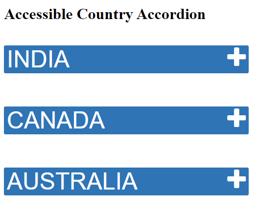

# Accessible Accordion Design
## Introduction
The below example section contains basic example about different countries. The same content can be replaced as per requirement. In this implementation, all panels of the accordion are collapsed at the same time and only one panel will be expanded at any given time.

## Accessibility Features
The visual design includes features intended to help keyboard users and assistive technology users. When an accordion header button receives focus, the header receives a solid black border as outline. On clicking, the header button it announces as expanded and collapsed accordingly. Each accordion has been marked up as a heading with a button wrapped inside it. The beauty of the accordion is that it uses native markup elements and only uses jQuery for expanding or collapsing the panel. 
## Keyboard Support
|  Key |  Function|
|---|---|
| Tab  |  Navigate to the next accordion |
| Shift + Tab  | Navigates to the previous accordion element.All focusable elements in the accordion are included in tab sequence.|
|  Down arrow |  When focus is on the accordion button, the focus moves to the next header.It also reads content inside the accordion panel when expanded.|
|  Up arrow | When focus is on the accordion button, the focus moves to the previous header.It also reads content inside the previous accordion panel if expanded.|
|  Enter or Spacebar | Expands or collapse the accordion  |

## ARIA Attributes

| Attributes  |  Description |
|---|---|
|  aria-expanded |  Set to true when the Accordion panel is expanded, otherwise set to false. |
|  aria-controls |  Points to the ID of the panel which the header controls. |
|  aria-hidden | aria-hidden	Hides collapsed content from screen readers. Set to true when the Accordion panel is collapsed otherwise set to false.  |
	
	
## Browser and Screen reader Support

| Operating System | Browser  | Screen Reader  | Compatible  |
|---|---|---|---|
|  Windows |  Chrome | JAWS  | Yes  |
|  Windows | Edge  |  JAWS | Yes  |
|  Windows | Firefox  | NVDA  | Yes  |
|  Windows |  IE 11 |  JAWS |  Yes |
| Mac  |  Safari |  Voiceover | Yes  |
|  IOS |  Safari | Voiceover  | Yes  |
|  Android |Chrome   | Talkback  | Yes  |
 		 	
			
			
			
	 		
			
			
			

